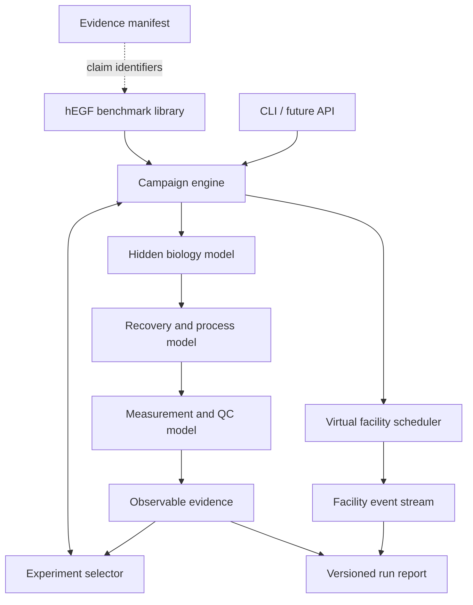
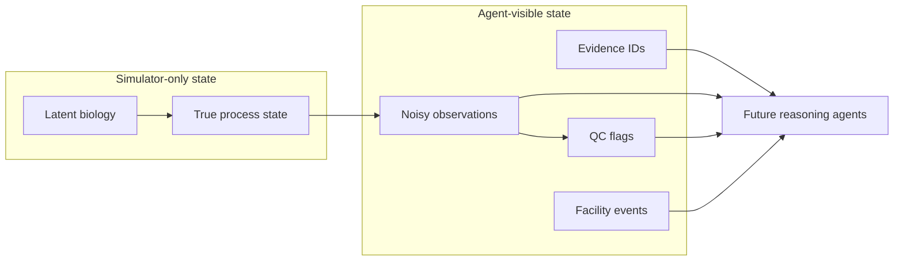

# PhytoForge Software Architecture

| Field | Value |
|---|---|
| Status | Executable scaffold |
| Release | `0.1.0` |
| Benchmark | `hegf-nb-transient-v0` |
| Runtime | Python 3.11+ |
| Calibration tier | S0 synthetic |
| Last updated | 2026-08-15 |

## 1. Architectural objective

PhytoForge separates scientific reasoning, quantitative evidence, and virtual execution so that no language-model agent can invent a measurement or silently alter a model result.

The executable scaffold implements one complete loop:

```text
bounded hEGF designs
    -> autonomous batch selection
    -> hidden biology simulation
    -> recovery and purification
    -> virtual facility execution
    -> noisy observations and QC
    -> observed utility
    -> next-round selection
```

The current models are transparent synthetic priors intended to verify software behavior. They are not fitted wet-lab predictors.

## 2. Component view



## 3. Layers

### 3.1 Domain layer

Location: `src/phytoforge/domain.py`

Defines immutable, versioned data exchanged between components:

- `Design`
- `CampaignConfig`
- `LatentBatchState`
- `ProcessOutcome`
- `Observation`
- `FacilityEvent`
- `ExperimentResult`
- `RunReport`

The public report removes `LatentBatchState` by default. Developer output must explicitly request it.

### 3.2 Benchmark layer

Location: `src/phytoforge/benchmarks/hegf.py`

Owns:

- benchmark identifier and calibration tier;
- bounded design library;
- study-context labels;
- design-to-evidence mappings; and
- future scenario registration.

It does not contain unrestricted sequence generation or physical protocols.

### 3.3 Scientific-model layer

Location: `src/phytoforge/models/`

`BiologyModel` produces hidden biomass, expression, integrity, stress, and failure state. `ProcessModel` applies extraction and capture losses while preserving target mass. `MeasurementModel` converts hidden state into noisy observations, quantification behavior, and QC flags.

Models are stateless. Random-number generators are injected explicitly, making replay and testing possible.

### 3.4 Virtual-execution layer

Location: `src/phytoforge/simulation/facility.py`

The facility scheduler models abstract operations on capacity-constrained resources:

- growth chamber;
- expression-introduction station;
- harvest station;
- extraction workcell;
- purification skid; and
- analytical station.

Version 0 implements a small deterministic scheduler in the standard library. A later discrete-event engine can replace it behind the same `FacilityEvent` interface.

### 3.5 Decision layer

Location: `src/phytoforge/optimizer.py`

Two selectors are provided:

- `random`: seeded baseline;
- `adaptive`: context-and-localization upper-confidence strategy.

The adaptive selector only sees prior observed utilities. It cannot inspect latent biology.

### 3.6 Orchestration layer

Location: `src/phytoforge/engine.py`

`SimulationEngine`:

1. validates campaign configuration;
2. asks the selector for an untested batch;
3. creates independent seeded random streams;
4. invokes biology, process, facility, and measurement components;
5. computes utility from observable values;
6. records evidence identifiers and selection decisions; and
7. repeats until the configured round limit or library exhaustion.

### 3.7 Interface layer

Location: `src/phytoforge/cli.py`

The CLI supports human-readable and JSON reports. A future HTTP API should call `SimulationEngine` rather than duplicating orchestration.

## 4. Trust boundary



Rules:

- selectors and future agents receive observations, not latent state;
- utility is calculated from observed values;
- evidence IDs must resolve to the reviewed manifest;
- model coefficients cannot be changed through agent prose;
- JSON hides latent state unless a developer explicitly enables it; and
- physical execution is not supported by this release.

## 5. Reproducibility strategy

- one campaign seed controls deterministic selection;
- each experiment receives a derived independent seed;
- models do not use global randomness;
- the facility scheduler is deterministic;
- the design library has stable identifiers;
- reports include configuration and schema version; and
- exact replay is enforced by a unit test.

Order-independent random streams and persisted run bundles are planned refinements.

## 6. Mass and information flow

Target mass follows:

```text
harvest target mass
    >= extracted target mass
    >= clarified target mass
    >= recovered target mass
    >= recovered intact target mass
```

Measurements may show apparent deviations because of error, but hidden process state must obey conservation. An apparent measured increase is an assay artifact and must not modify latent mass.

## 7. Repository layout

```text
.
├── data/evidence/
│   └── hegf_sources.yaml
├── docs/
│   ├── ARCHITECTURE.md
│   ├── MODEL_SPECIFICATION.md
│   ├── PRODUCT_REQUIREMENTS.md
│   └── benchmarks/HEGF.md
├── src/phytoforge/
│   ├── benchmarks/hegf.py
│   ├── models/
│   │   ├── biology.py
│   │   ├── measurement.py
│   │   └── process.py
│   ├── simulation/facility.py
│   ├── cli.py
│   ├── domain.py
│   ├── engine.py
│   └── optimizer.py
├── tests/test_simulator.py
└── pyproject.toml
```

## 8. Execution

Without installation:

```bash
PYTHONPATH=src python3 -m phytoforge --seed 42 --rounds 4 --batch-size 4
```

Machine-readable report:

```bash
PYTHONPATH=src python3 -m phytoforge --json
```

Developer-only latent-state report:

```bash
PYTHONPATH=src python3 -m phytoforge --json --show-latent
```

Tests:

```bash
PYTHONPATH=src python3 -m unittest discover -s tests -v
```

## 9. Current limitations

- all scientific coefficients are S0 synthetic priors;
- no raw experimental dataset is fitted;
- facility failures are represented in the domain but not yet injected;
- the adaptive selector is a transparent baseline, not Bayesian optimization;
- no reasoning-agent runtime is connected;
- no database or durable run store exists;
- no API or graphical interface exists; and
- no physical laboratory adapter exists.

## 10. Next implementation increments

1. Move synthetic parameters into a versioned registry.
2. Add scenario and fault-injection configuration.
3. Persist and replay complete run bundles.
4. Add random, greedy, and adaptive benchmark comparisons across seeds.
5. Implement typed agent tools over observations and evidence.
6. Add an HTTP API and event-stream interface.
7. Build the virtual biofactory control-room UI.
8. Calibrate only those model components supported by suitable source-level data.
