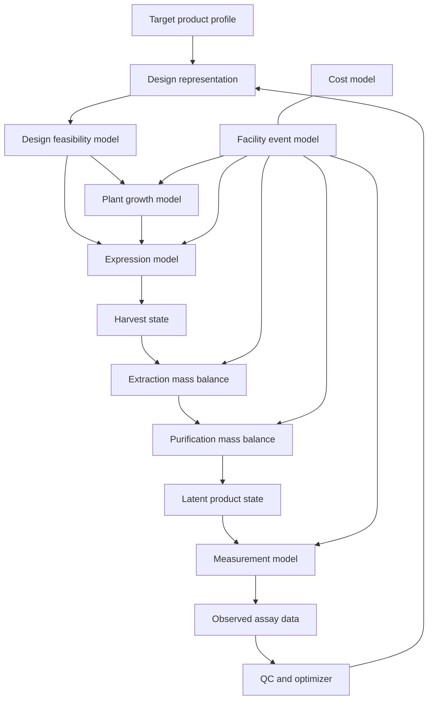

# PhytoForge Scientific and Simulation Model Specification

| Field | Value |
|---|---|
| Document status | Draft technical specification |
| Model release | `0.1-concept` |
| Intended use | Simulation, hypothesis generation, and software validation |
| Prohibited interpretation | Experimental, clinical, manufacturing, or regulatory validation |
| Last updated | 2026-08-15 |

## 1. Purpose

This document specifies the quantitative and software models required for the first PhytoForge prototype. The model represents an end-to-end, contained plant molecular-farming campaign:

1. define a target product profile;
2. select an abstract expression design;
3. grow a virtual *Nicotiana benthamiana* batch;
4. initiate transient expression;
5. accumulate and degrade product;
6. harvest biomass;
7. extract and purify recoverable product;
8. measure yield and quality with noise; and
9. choose the next experiment under constraints.

The first implementation is intentionally a scientifically structured synthetic environment. It should produce plausible relationships, conservation behavior, uncertainty, and failure modes—not claims of accurate wet-lab prediction.

## 2. Modeling principles

### 2.1 Separate latent truth from observation

The simulator maintains an unobserved biological and process state. Assays generate imperfect observations from that state. Agents may only access configured observations, not latent values.

### 2.2 Preserve causality and mass balance

Design choices affect expression; environmental and plant state affect biomass and expression; downstream recovery acts on available product; measurements observe recovered material. No downstream model may create product mass.

### 2.3 Represent multiple uncertainty sources

At minimum:

- parameter uncertainty;
- plant-to-plant variability;
- batch effects;
- process variability;
- device error;
- measurement noise; and
- model discrepancy.

### 2.4 Prefer interpretable baselines

Version 0 begins with equations, bounded transformations, and hierarchical random effects. Learned models may replace components only when they can be validated against held-out data.

### 2.5 Abstain outside the applicable domain

Every model run returns an applicability grade. Unsupported hosts, production modes, product classes, or process steps must produce an explicit refusal or low-confidence result rather than an extrapolated high-confidence number.

## 3. Scope

### 3.1 Included in version 0

- contained *N. benthamiana* production;
- transient expression represented at an abstract design level;
- batch and plant growth;
- target-protein accumulation and degradation;
- stress-related expression and biomass penalties;
- harvest timing;
- extraction and serial purification mass balance;
- simplified product-quality attributes;
- facility resources, queues, consumables, failures, and drift;
- measurement generation;
- multi-round experiment selection; and
- campaign cost and cycle time.

### 3.2 Excluded from version 0

- environmental release or ecological spread;
- stable transgenic line development;
- edible vaccines;
- mechanistic immunogenicity or clinical efficacy;
- patient dosing;
- detailed fluid dynamics;
- molecular dynamics;
- atomistic protein folding;
- regulatory release testing;
- GMP compliance claims;
- real robot control; and
- exact laboratory recipes.

## 4. System decomposition



Each block must expose a versioned interface and must be independently testable.

## 5. Units and conventions

The implementation must use an explicit units library or validated unit fields. Internal defaults:

| Quantity | Default unit |
|---|---|
| Time | hour |
| Biomass | gram fresh weight |
| Product mass | milligram |
| Concentration | milligram per gram fresh weight |
| Volume | milliliter |
| Temperature | degree Celsius |
| Cost | configured project currency |
| Probability/fraction | dimensionless, bounded `[0, 1]` |

Model outputs must not silently mix fresh weight, dry weight, concentration, total mass, or assay signal.

## 6. Canonical inputs

### 6.1 Target product profile

```json
{
  "target_id": "tpp_demo_001",
  "intended_use": "research_reagent",
  "protein_class": "soluble_recombinant_protein",
  "sequence_ref": "private://sequence/target-001",
  "assembly_state": "monomer",
  "quality_requirements": {
    "minimum_purity_fraction": 0.9,
    "maximum_aggregate_fraction": 0.1
  },
  "campaign_constraints": {
    "maximum_virtual_batches": 12,
    "maximum_cost": 50000,
    "maximum_elapsed_hours": 1500
  }
}
```

Sequence values should be stored separately from general event logs and agent prompts. The simulator may use derived, non-sensitive descriptors.

### 6.2 Design

The MVP uses abstract, curated design choices rather than generating unrestricted biological sequences.

```json
{
  "design_id": "design_0042",
  "parent_design_ids": ["design_0011"],
  "host": "nicotiana_benthamiana",
  "production_mode": "transient_contained",
  "components": {
    "expression_backbone": "library://backbone/A",
    "regulatory_profile": "library://regulatory/medium",
    "localization_strategy": "library://localization/secretory",
    "stability_module": "library://stability/default"
  },
  "derived_features": {
    "expression_prior": 0.55,
    "burden_prior": 0.2,
    "degradation_prior": 0.3,
    "recovery_prior": 0.6
  },
  "provenance": {
    "generator": "plant_expression_agent",
    "model_version": "design-generator-0.1"
  }
}
```

### 6.3 Campaign configuration

- number of plants or virtual production units;
- batch structure and controls;
- environmental set points;
- intervention and harvest windows;
- downstream process path;
- measurement panel;
- facility configuration;
- fault scenario;
- random seed; and
- model versions.

## 7. Design feasibility model

The feasibility model runs before any biological simulation.

### 7.1 Hard constraints

- all components exist and are permitted for the project;
- component combination is represented in the compatibility matrix;
- required operations are supported by the configured facility;
- process volumes and capacities are valid;
- required controls are present; and
- all model applicability requirements are met.

### 7.2 Soft liabilities

Soft liabilities are represented as typed penalties with evidence and uncertainty:

- predicted expression burden;
- product instability;
- localization mismatch;
- difficult recovery;
- quality risk; and
- unsupported component interaction.

The feasibility model returns:

```text
status: feasible | infeasible | review_required
hard_failures: list[ConstraintViolation]
liabilities: list[Liability]
applicability: in_domain | near_domain | out_of_domain
```

## 8. Plant growth model

Version 0 uses a stress-modified logistic biomass model for plant or production-unit `i`:

```math
\frac{dB_i}{dt}
=
\mu_{\max}
g_T(T_t)
g_L(L_t)
g_W(W_{i,t})
(1 - \lambda_S S_{i,t})
B_i
\left(1 - \frac{B_i}{K_i}\right)
- d_B B_i
```

Where:

- `B_i(t)` is fresh biomass;
- `μ_max` is maximum growth rate;
- `g_T`, `g_L`, and `g_W` are bounded environmental response functions;
- `S_i(t)` is latent stress in `[0, 1]`;
- `λ_S` controls the growth penalty from stress;
- `K_i` is carrying biomass; and
- `d_B` is background biomass loss.

Environmental responses should use smooth bounded functions. For example:

```math
g_T(T) = \exp\left[-\frac{(T - T_{opt})^2}{2\sigma_T^2}\right]
```

Parameters vary hierarchically:

```math
\theta_i \sim \mathcal{D}(\theta_{batch}, \sigma_{plant})
```

and:

```math
\theta_{batch} \sim \mathcal{D}(\theta_{global}, \sigma_{batch})
```

The exact parameter distributions are configuration data, not hard-coded constants.

## 9. Stress model

Stress links operations, environment, expression burden, and downstream biological performance:

```math
\frac{dS_i}{dt}
=
k_{env} E_{stress}(t)
+ k_{op} O_{stress}(t)
+ k_{burden} A_i(t)
- k_{recover} S_i(t)
```

The numerical solution is bounded to `[0, 1]`.

Stress can:

- slow growth;
- reduce productive expression;
- increase product degradation;
- increase plant-to-plant variability; and
- create visible QC signals.

Version 0 treats stress as a latent aggregate and does not claim mechanistic representation of specific pathways.

## 10. Expression and product-accumulation model

### 10.1 Product concentration

For recoverable target product concentration `P_i(t)`:

```math
\frac{dP_i}{dt}
=
k_{syn,i}
A_i(t)
g_B(B_i)
g_S(S_i)
-
\left(k_{deg,i}(t) + k_{dil,i}(t)\right) P_i(t)
```

Where:

- `k_syn,i` is design- and product-dependent synthesis capacity;
- `A_i(t)` is a bounded onset and activity function;
- `g_B` captures plant-state dependence;
- `g_S` captures the productivity penalty from stress;
- `k_deg,i` includes baseline and stress-associated degradation; and
- `k_dil,i` represents concentration dilution from biomass growth where applicable.

### 10.2 Design effects

Version 0 derives latent rates from an interpretable generalized model:

```math
\log k_{syn,i}
=
\beta_0
+ \beta^\top x_{design}
+ u_{protein}
+ u_{batch}
+ u_i
- \rho_{burden}
```

```math
\log k_{deg,i}
=
\gamma_0
+ \gamma^\top x_{product}
+ v_{localization}
+ v_{stress} S_i(t)
+ \epsilon_i
```

Feature coefficients begin as documented synthetic priors. Literature-informed or learned coefficients must carry dataset and calibration metadata.

### 10.3 Harvestable product

At harvest time `t_h`:

```math
M_{target,harvest}
=
\sum_i B_i(t_h) P_i(t_h)
```

All later product-mass values must be less than or equal to this value, except where a measurement-error model produces an explicitly flagged apparent value.

## 11. Product quality model

The target product is partitioned into mutually exclusive latent quality states:

```math
f_{intact} + f_{aggregate} + f_{fragment} + f_{other} = 1
```

Quality-state logits depend on:

- product descriptors;
- localization strategy;
- stress exposure;
- residence time before harvest;
- extraction conditions;
- purification path; and
- uncertain batch effects.

For quality state `q`:

```math
\Pr(q)
=
\operatorname{softmax}
\left(
\alpha_q
+ w_q^\top x
+ b_{q,batch}
\right)
```

Optional glycoform compatibility is represented only as a coarse categorical risk in version 0:

```text
compatible | uncertain | incompatible | not_applicable
```

It must not be interpreted as a molecular glycosylation prediction.

## 12. Harvest, extraction, and purification model

### 12.1 Extraction

```math
M_{extract}
=
M_{target,harvest}
\eta_{release}
\eta_{clarification}
\left(1 - \ell_{hold}\right)
```

Each efficiency is bounded `[0, 1]` and sampled from a configured distribution conditional on product and process descriptors.

### 12.2 Serial purification

For purification step `j`:

```math
M_{j,out} = M_{j,in} \eta_{j,target}
```

```math
I_{j,out,k} = I_{j,in,k} \eta_{j,impurity,k}
```

Where:

- `M` is target-product mass;
- `I_k` is impurity class `k`; and
- `η` values describe retained fractions.

Purity after step `j`:

```math
Purity_j
=
\frac{M_{j,out}}
{M_{j,out} + \sum_k I_{j,out,k}}
```

### 12.3 Recoverable usable product

```math
M_{usable}
=
M_{final}
f_{intact}
\mathbb{1}[\text{quality gates pass}]
```

The indicator is zero when a configured hard quality gate fails.

## 13. Measurement model

Measurements are generated from latent states:

```math
y_{a,s}
=
h_a(z_s)
+ b_{plate(a)}
+ b_{batch(a)}
+ d_a(t)
+ \epsilon_{a,s}
```

Where:

- `a` is assay type;
- `s` is sample;
- `z_s` is the latent sample state;
- `h_a` maps latent state to expected assay response;
- `b_plate` and `b_batch` are random effects;
- `d_a(t)` is device drift; and
- `ε` is residual noise.

Supported abstract assay classes:

- biomass or plant-state imaging;
- expression proxy;
- target quantity;
- purity;
- aggregation proxy;
- activity proxy; and
- process-control measurement.

Each observation includes:

- numeric or categorical value;
- unit;
- lower and upper quantification limits;
- uncertainty;
- QC flags;
- assay and device version;
- sample and lot provenance; and
- whether the observation is synthetic or measured.

## 14. Cost model

Total campaign cost:

```math
C_{total}
=
C_{materials}
+ C_{consumables}
+ C_{device}
+ C_{labor}
+ C_{facility}
+ C_{failure}
+ C_{waste}
```

Version 0 uses configurable unit costs and event durations. It does not claim to predict commercial cost of goods.

Reported economic outputs:

- total simulated campaign cost;
- cost per attempted design;
- cost per successful design;
- cost per unit of recoverable product;
- cost of failed or repeated operations; and
- device utilization.

## 15. Discrete-event virtual facility

### 15.1 Facility resources

Version 0 should provide abstract implementations for:

- growth chamber;
- liquid-handling workcell;
- expression-introduction station;
- imaging station;
- harvest station;
- extraction workcell;
- purification skid;
- plate reader or analytical station;
- cold storage; and
- human-review gate.

These are software resources, not claims that a single physical implementation supports every operation.

### 15.2 Device contract

```text
Device
  id
  device_type
  capabilities
  capacity
  calendar
  state
  calibration_state
  supported_operation_versions

Operation
  id
  operation_type
  inputs
  outputs
  prerequisites
  required_capabilities
  duration_distribution
  resource_requirements
  failure_model
  quality_checks
```

### 15.3 Event types

- material created, moved, split, pooled, consumed, or discarded;
- operation queued, started, paused, completed, failed, or retried;
- device reserved, released, calibrated, drifted, or unavailable;
- observation requested, produced, invalidated, or reviewed;
- agent decision proposed, approved, rejected, or superseded; and
- campaign stopped.

### 15.4 Failure model

Version 0 supports configurable, non-procedural fault classes:

- scheduling delay;
- capacity conflict;
- consumable shortage;
- device unavailability;
- calibration drift;
- sample-label mismatch;
- cross-sample contamination signal;
- incomplete operation;
- environmental excursion;
- assay failure; and
- biological batch underperformance.

Faults may be injected deterministically for tests or sampled from configured hazard models:

```math
\Pr(F_k \text{ in } [t,t+\Delta t])
=
1 - \exp[-\lambda_k(x_t)\Delta t]
```

## 16. Protocol compiler

The compiler converts an abstract campaign graph into facility operations.

Compilation stages:

1. schema validation;
2. dependency expansion;
3. capability matching;
4. material and capacity checks;
5. control insertion;
6. scheduling;
7. policy-gate insertion;
8. dry-run simulation; and
9. immutable protocol version creation.

Compiler errors must be typed and actionable:

- unsupported operation;
- missing material;
- incompatible unit;
- insufficient capacity;
- impossible dependency;
- unavailable device;
- missing control;
- policy violation; or
- unresolved ambiguity.

The MVP exports only a simulator protocol. Physical-device adapters are outside version 0.

## 17. Experiment-selection model

### 17.1 Optimization problem

Select candidate batch `X` that maximizes expected utility and information under constraints:

```math
\max_X
\quad
\mathbb{E}[U(X)]
+ \lambda_{info} I(X)
- \lambda_{risk} R(X)
```

Subject to:

```math
C(X) \le C_{remaining}
```

```math
T(X) \le T_{remaining}
```

```math
X \subseteq \mathcal{F}
```

where `𝔽` is the feasible design set.

### 17.2 Objectives

- maximize recoverable usable product;
- maximize configured quality attributes;
- minimize cost;
- minimize cycle time;
- minimize variance and failure probability; and
- maximize information gain where uncertainty affects a decision.

### 17.3 Baselines

Every optimization demonstration must compare against:

- random feasible selection;
- fixed default design;
- greedy predicted-yield selection; and
- simple factorial or coverage strategy where applicable.

### 17.4 Stopping conditions

- success criteria met with configured confidence;
- campaign budget exhausted;
- no feasible candidates remain;
- expected improvement below threshold for configured rounds;
- uncertainty cannot be reduced with supported observations;
- critical QC or policy stop; or
- user stop.

## 18. Agent–model boundary

Agents operate through typed tools. A model result cannot be modified by natural-language reasoning.

Required tool categories:

- retrieve evidence;
- query component library;
- validate design;
- run predictive model;
- compile protocol;
- execute simulation;
- query observations;
- perform statistical analysis;
- propose candidate batch; and
- record claim or decision.

An agent response used for a decision must include:

```json
{
  "claim_type": "hypothesis",
  "claim": "Design family B may improve recoverable yield.",
  "supporting_ids": [
    "model_run_017",
    "observation_221"
  ],
  "contradicting_ids": [
    "observation_198"
  ],
  "confidence": "low",
  "recommended_action": "compare_B_against_control"
}
```

The orchestrator rejects:

- missing provenance;
- references to nonexistent evidence;
- measurements stated without observation IDs;
- unsupported action types; and
- attempts to expose latent simulator state.

## 19. Uncertainty and applicability

### 19.1 Predictive output

Every prediction returns:

- central estimate;
- interval or posterior samples;
- aleatoric and epistemic components where identifiable;
- applicability grade;
- calibration tier;
- model version;
- major sensitivity drivers; and
- warnings.

### 19.2 Calibration tiers

| Tier | Data source | Permitted interpretation |
|---|---|---|
| S0 | Hand-authored synthetic parameters | Software demonstration only |
| S1 | Literature-informed priors | Plausibility exploration |
| S2 | Retrospective experimental calibration | Retrospective research evaluation |
| S3 | Prospective partner validation | Decision support within validated domain |

The user interface must display the active tier. Version 0 is S0 unless a dataset-specific evaluation states otherwise.

### 19.3 Out-of-domain detection

Applicability checks consider:

- host and production mode;
- protein-class descriptors;
- component-library coverage;
- process path;
- assay range;
- facility configuration; and
- distance from calibration data.

Out-of-domain runs may be simulated for exploration but cannot receive an advancement recommendation.

## 20. Parameter registry

All parameters live in version-controlled configuration with:

- name and definition;
- unit and valid range;
- distribution;
- hierarchy level;
- evidence source;
- calibration dataset;
- date and author;
- model components using the parameter; and
- sensitivity rank.

No scientific parameter should exist only as an unexplained literal in code.

## 21. Validation strategy

### 21.1 Software verification

- schema and unit validation;
- deterministic seeded replay;
- event-order invariants;
- material lineage consistency;
- non-negativity;
- fraction bounds;
- capacity constraints; and
- product mass conservation.

### 21.2 Model-behavior verification

Test expected qualitative behavior:

- zero synthesis produces zero target product;
- higher degradation does not increase final target mass;
- recovery efficiencies above zero and below one cannot increase mass;
- delayed harvest produces the configured accumulation–degradation trade-off;
- greater stress does not improve output unless an explicitly modeled response permits it;
- added purification steps trade target recovery against impurity removal;
- device drift changes observations, not latent biology; and
- replicate variance increases with configured plant and batch variance.

### 21.3 Synthetic recovery tests

Generate datasets from known parameters and verify that inference procedures recover those parameters within expected uncertainty.

### 21.4 Retrospective evaluation

For each imported dataset:

- pre-register included outcomes and splits;
- prevent related designs or batches from leaking across splits;
- compare against simple baselines;
- report calibration as well as ranking;
- retain negative results; and
- document domain mismatch.

### 21.5 Prospective evaluation

A partner pilot should blind the platform to outcomes, rank a bounded candidate set, and evaluate:

- top-k hit rate;
- rank correlation;
- interval coverage;
- error in recoverable yield;
- experimental efficiency; and
- failure diagnosis.

No model should advance from S2 to S3 based solely on retrospective performance.

## 22. Required benchmark scenarios

1. **Nominal campaign:** no injected faults; moderate design differences.
2. **High-expression trap:** high upstream expression but poor downstream recovery.
3. **Late-harvest trap:** continued biomass growth with increasing degradation.
4. **Batch-effect challenge:** one batch systematically underperforms.
5. **Measurement-drift challenge:** apparent trend caused by an analytical device.
6. **Resource-contention challenge:** optimal biological design creates a facility bottleneck.
7. **Sparse-budget challenge:** optimizer must choose between exploitation and information.
8. **Out-of-domain target:** system must abstain from advancement.
9. **Sample-identity challenge:** provenance and QC must detect inconsistent labels.
10. **Reproducibility challenge:** exported run must replay exactly.

## 23. Model performance reporting

The model card for each release must report:

- intended and excluded uses;
- calibration tier;
- training and evaluation datasets;
- baseline comparisons;
- ranking, regression, and calibration metrics;
- subgroup or domain performance;
- known failure modes;
- sensitivity analysis;
- unresolved scientific assumptions; and
- change history.

Aggregate objective improvement alone is insufficient because an optimizer can exploit simulator artifacts.

## 24. Initial implementation interfaces

```text
DesignModel.propose(context) -> list[Design]
FeasibilityModel.evaluate(design, facility) -> FeasibilityResult
BiologyModel.simulate(design, campaign, seed) -> LatentBatchState
ProcessModel.simulate(latent_batch, process, seed) -> LatentProductState
MeasurementModel.observe(latent_state, assay_plan, seed) -> list[Observation]
ProtocolCompiler.compile(campaign, facility) -> CompiledProtocol
FacilitySimulator.execute(protocol, seed) -> EventStream
Optimizer.select(history, candidates, budget, seed) -> ExperimentBatch
PolicyEngine.authorize(action, context) -> AuthorizationResult
Reporter.build(project) -> EvidencePackage
```

Interfaces exchange immutable, schema-versioned objects. Random number generators are passed explicitly rather than accessed globally.

## 25. Scientific limitations

The model cannot initially answer whether:

- a protein will be biologically active in its intended application;
- a plant-derived quality profile is acceptable for a patient;
- a vaccine will produce protective immunity;
- a process will scale predictably;
- a product satisfies purity, potency, or safety specifications; or
- a regulator will accept the manufacturing system.

Those questions require experimental evidence and qualified review.

## 26. Decisions required before implementation

1. Select the first abstract protein class and benchmark target profile.
2. Define the version 0 component library and compatibility matrix.
3. Choose the simulation framework and numerical solver.
4. Define canonical schemas and units implementation.
5. Set synthetic parameter priors and document their rationale.
6. Choose the first optimization baseline and acquisition strategy.
7. Define the virtual facility and supported operation graph.
8. Identify a public retrospective dataset, if one is sufficiently structured.
9. Establish model-card and run-bundle formats.

## 27. References and standards

- Peyret, H. et al. “Plant molecular farming for pharmaceuticals: the state of the art.” *npj Science of Plants* (2026). <https://www.nature.com/articles/s44383-026-00035-7>
- U.S. Food and Drug Administration. Elelyso approval summary (2012). <https://www.accessdata.fda.gov/drugsatfda_docs/nda/2012/022458Orig1s000SumR.pdf>
- Synthetic Biology Open Language (SBOL). <https://sbolstandard.org/>
- Systems Biology Markup Language (SBML). <https://sbml.org/>

